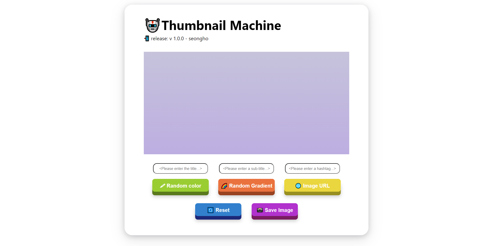
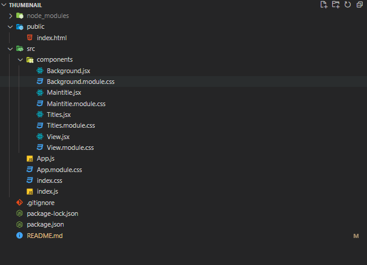

# 🤖Thumbnail_machine

리액트로 만든 동영상 썸네일 제작 웹페이지

## 🖥️ 프로젝트 소개

리액트로 처음 만들어 본 토이프로젝트입니다.

 

## 🕰️ 개발 기간

-   23.07.18 - 23.07.19 (2일)

### ⚙️ 개발 환경
---

-   `React 18 (useState, useRef)`
-   `CSS (CSS-module)`
-   `IDE : VScode 1.80`
-   `ETC : Github / Mac Os 환경에서 개발`
-   `DEPLOY : Github.io`

### 📁 폴더 구조
---

#### 📂 components
- 화면을 구성하는 작은 요소 단위의 컴포넌트들을 담아 놓은 폴더입니다.

## 📌 주요 기능

#### 썸네일 내용 입력

-   메인 제목 작성 및 출력
-   서브 제목 작성 및 출력
-   관련 해시태그 작성 및 출력

#### 랜덤 컬러

-   버튼 클릭 시 무작위로 배경 컬러 출력

#### 랜덤 그라데이션

-   버튼 클릭 시 무작위로 배경 그라데이션 출력

#### 배경 이미지 추가

-   이미지 주소를 입력하면 배경 이미지 변경

#### 초기화

-   버튼 클릭 시 입력된 모든 정보 초기화

#### 이미지 저장

-   글 작성, 읽기, 수정, 삭제(CRUD)